# Recreo: Recreation, Entertainment & Wellness Hub

Recreo is a comprehensive mobile application built with React Native and Expo, designed to be a one-stop destination for users seeking recreation, entertainment, and wellness activities. It offers a personalized experience by allowing users to select their interests and provides a dynamic, feature-rich platform to engage with various activities, connect with a community, and manage their well-being.

The application is architected with a modern, scalable approach, utilizing Supabase for backend services, ensuring a seamless and secure user experience. It features a beautiful, theme-able UI that adapts to user preferences (light/dark/system).
## Demo & Screenshots

* **Video Demo:** [Watch here](https://drive.google.com/file/d/13ZY357nKGq6DYsoDj2G-9OhK8tg5oga7/view)
* **Screenshots:**

<table>
  <tr>
    <td align="center" style="padding:10px;">
      <b>Login Screen</b><br/><br/>
      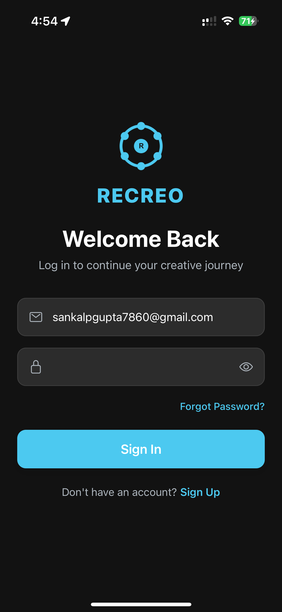
    </td>
    <td align="center" style="padding:10px;">
      <b>Home Screen</b><br/><br/> 
      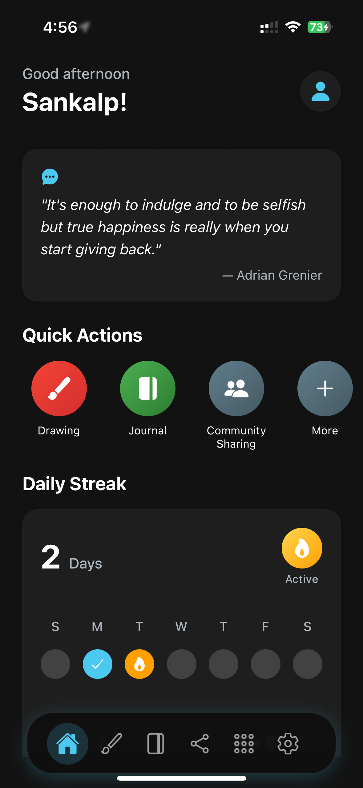
    </td>
  </tr>
  <tr>
    <td align="center" style="padding:10px;">
      <b>Drawing Canvas</b><br/><br/>
      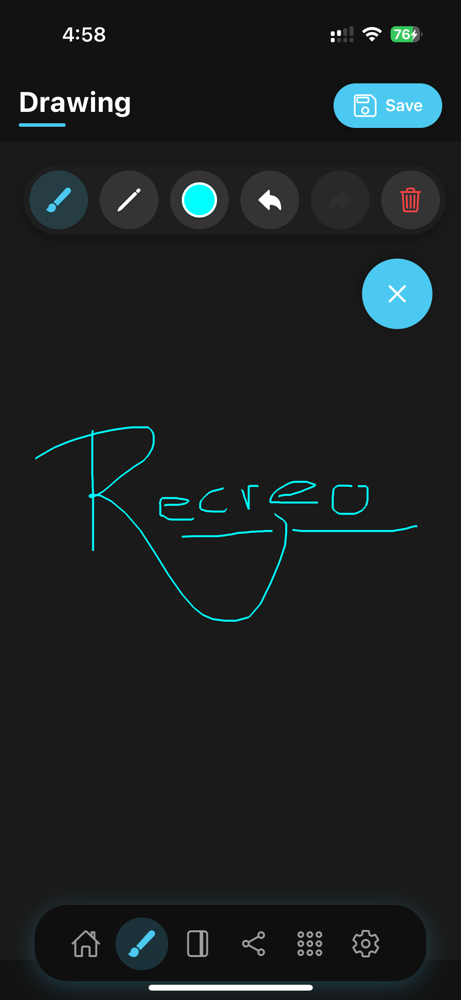
    </td>
    <td align="center" style="padding:10px;">
      <b>Community Sharing</b><br/><br/>
      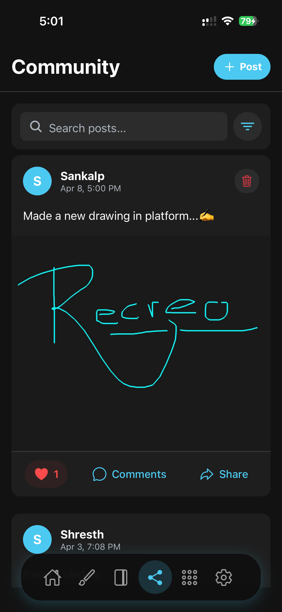
    </td>
  </tr>
  <tr>
    <td align="center" style="padding:10px;">
      <b>Journal Screen</b><br/><br/>
      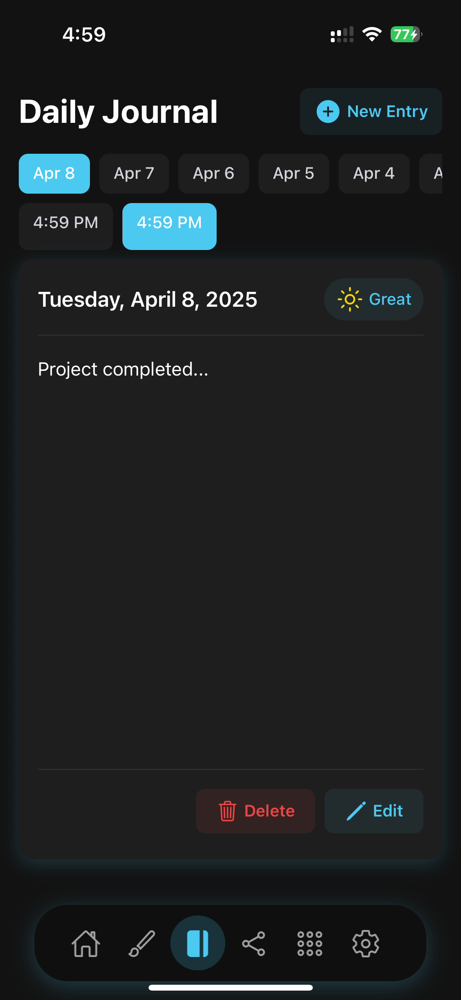
    </td>
    <td align="center" style="padding:10px;">
      <b>Music Player</b><br/><br/>
      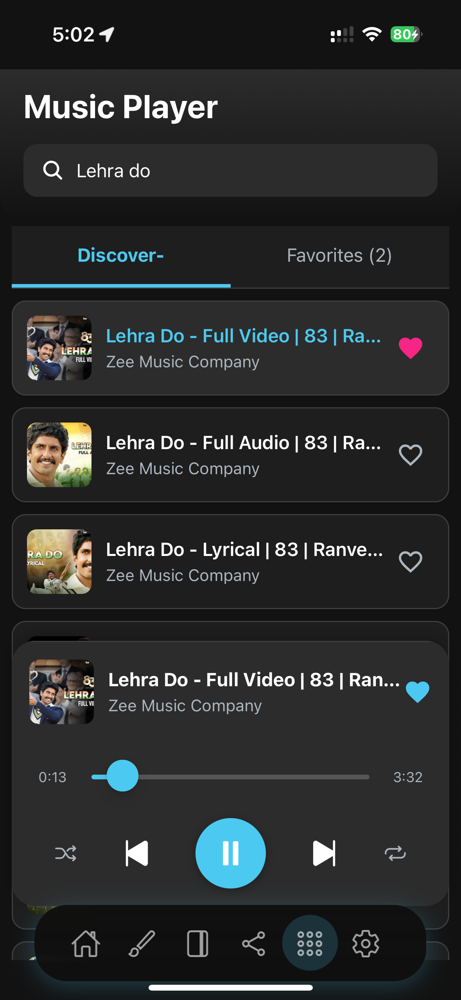
    </td>
  </tr>
  <tr>
    <td align="center" style="padding:10px;">
      <b>Book Discovery</b><br/><br/>
      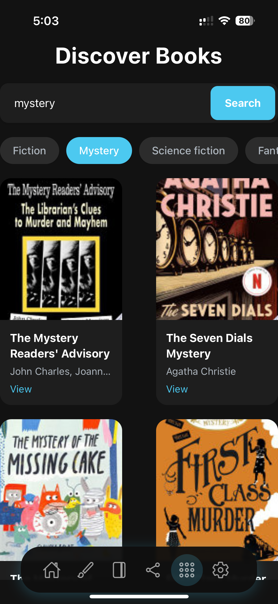
    </td>
    <td align="center" style="padding:10px;">
      <b>Classic Games</b><br/><br/>
      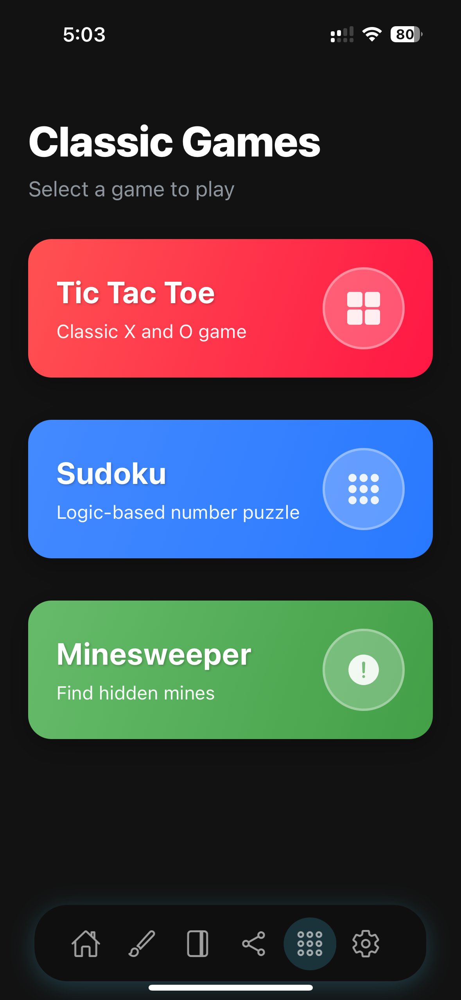
    </td>
  </tr>
  <tr>
    <td align="center" style="padding:10px;">
      <b>Yoga & Wellness</b><br/><br/>
      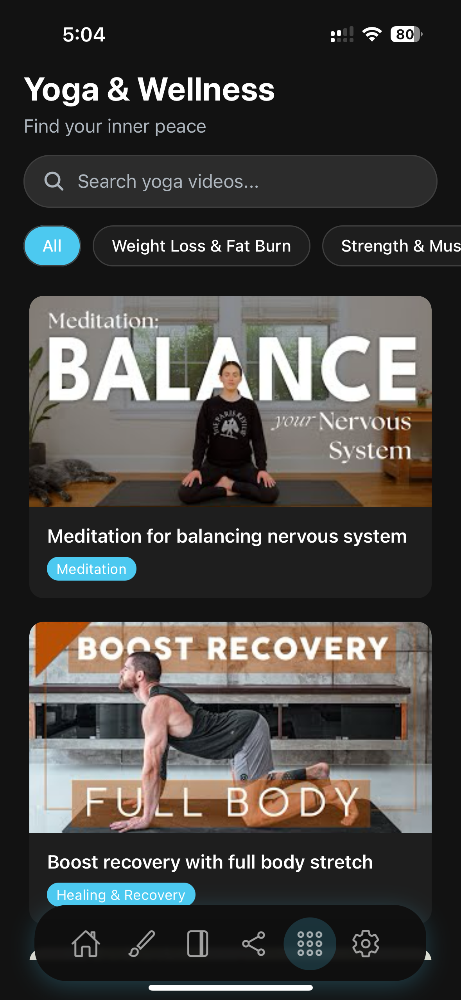
    </td>
    <td align="center" style="padding:10px;">
      <b>News Feed</b><br/><br/>
      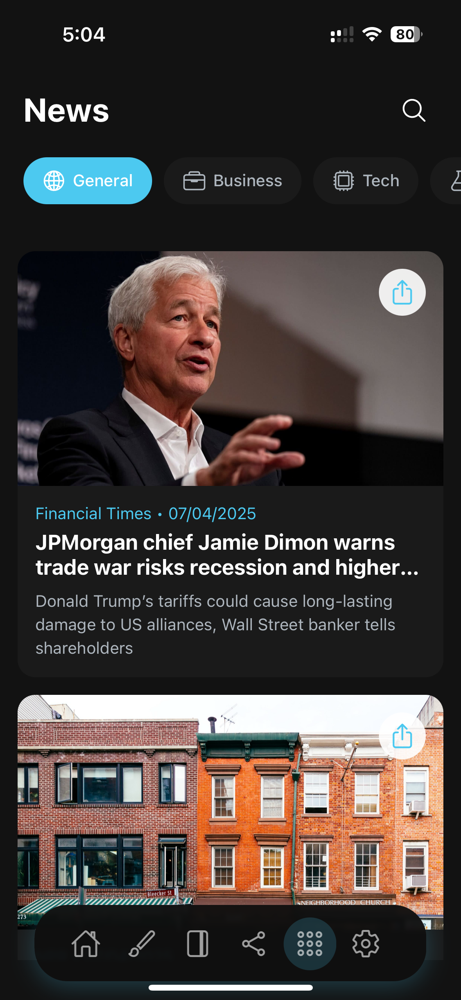
    </td>
  </tr>
  <tr>
    <td align="center" style="padding:10px;">
      <b>Settings Screen</b><br/><br/>
      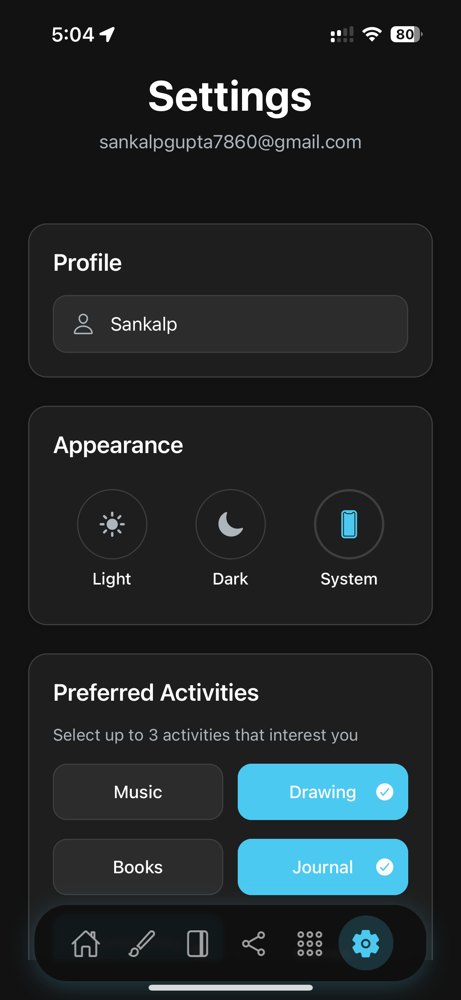
    </td>
    <td align="center" style="padding:10px;">
      <b>Admin Panel</b><br/><br/> 
      
    </td>
  </tr>
</table>


## Key Features

* Secure Authentication: Full email/password authentication flow (Login, Register, Forgot Password) powered by Supabase Auth.

* Personalized Experience: Users can select their top 3 interests (e.g., Music, Drawing, Books) upon registration to customize their in-app experience.

* Dynamic Home Feed: A welcoming home screen that greets users, displays a daily inspirational quote, and provides quick access to their favorite activities.

* Daily Streak Tracker: Motivates users to engage with the app daily by tracking their current and longest streaks.

* Music Player: An integrated YouTube-based music player to search and listen to tracks, with the ability to manage a personal list of favorites.

* Daily Journal: A private space for users to write down their thoughts, track their mood, and view past entries in a calendar format.

* Drawing Canvas: A feature-rich drawing tool with color palettes, adjustable stroke widths, an eraser, and the ability to save creations to the device.

* Book Discovery: Fetches and displays books from the Google Books API, allowing users to search, browse by category, and view details.

* Yoga & Wellness: A curated collection of yoga and wellness videos fetched from a Supabase backend, which can be managed by admin users.

* News Feed: Stay updated with the latest news, filterable by various categories.

* Classic Games: In-app mini-games including Tic-Tac-Toe, Sudoku, and Minesweeper.

* Community Sharing: A social feed where users can create posts with text and images, comment on posts, and like content.

* Admin Panel: Special administrative privileges to manage content, such as adding/deleting yoga videos and viewing all users.

* Theme Support: Seamlessly switch between Light, Dark, and System themes for a comfortable viewing experience.

* Navigation: Robust navigation handled by Expo Router, including tabbed navigation for main features and a separate stack for authentication.

## Tech Stack

* Framework: React Native with Expo
* Backend: Supabase (Authentication, Database, Storage)
* Navigation: Expo Router
* State Management: React Context API
* Styling: React Native StyleSheet with dynamic theming
* UI Components: Custom-built components, react-native-elements, expo-blur
* Animations: React Native Animated & Reanimated
* Async Storage: @react-native-async-storage/async-storage & expo-secure-store
* APIs: Google Books API, YouTube API, NewsAPI
* Database: PostgreSQL (via Supabase)
* Deployment: Expo Application Services (EAS)

## Folder Structure

```
.
├── app/                      # Main application source code using Expo Router
│   ├── (auth)/               # Authentication-related screens (grouped layout)
│   │   ├── index.tsx         # Initial auth route, redirects to login
│   │   ├── login.tsx         # User login screen
│   │   ├── register.tsx      # User registration screen
│   │   └── select-activities.tsx # Screen for new users to select interests
│   ├── (tabs)/               # Main application screens with tab navigation
│   │   ├── _layout.tsx       # Defines the tab bar layout and dynamic tabs
│   │   ├── admin.tsx         # Admin panel (placeholder)
│   │   ├── books.tsx         # Book discovery feature
│   │   ├── community-sharing.tsx # Community feed screen
│   │   ├── drawing.tsx       # Drawing canvas screen
│   │   ├── games.tsx         # Games hub screen
│   │   ├── index.tsx         # Home screen
│   │   ├── journal.tsx       # Daily journal feature
│   │   ├── more.tsx          # Screen to discover other activities
│   │   ├── music.tsx         # Music player screen
│   │   ├── news.tsx          # News feed screen
│   │   ├── settings.tsx      # User settings and profile management
│   │   ├── users.tsx         # Admin screen to view and manage users
│   │   └── yoga.tsx          # Yoga and wellness video screen
│   ├── _layout.tsx           # Root layout of the app, wraps with providers
│   ├── index.tsx             # Entry point, handles redirection based on auth state
│   └── +not-found.tsx        # Fallback screen for unmatched routes
├── assets/                   # Static assets like images and fonts
│   └── images/               # App icons and other image assets
├── components/               # Reusable UI components
│   ├── Loader.tsx            # App-wide loading indicator
│   └── games/                # Components for the mini-games
│       ├── Minesweeper.tsx
│       ├── Sudoku.tsx
│       └── TicTacToe.tsx
├── constants/                # Application constants (e.g., API keys, config)
│   └── Config.ts
├── context/                  # React Context providers for global state
│   ├── AuthContext.tsx       # Manages user authentication state
│   └── ThemeContext.tsx      # Manages app-wide theming (light/dark mode)
├── hooks/                    # Custom React hooks
│   └── useFrameworkReady.ts
├── lib/                      # Library configurations
│   └── supabase.ts           # Supabase client initialization
├── supabase/                 # Supabase migration files
│   └── migrations/
└── package.json              # Project dependencies and scripts
```

## Setup and Installation

To get this project up and running on your local machine, follow these steps:

### Clone the repository:

```bash
git clone https://github.com/Sankalp7860/Project-07-Recreo.git
cd Project-07-Recreo
```

### Install dependencies:

```bash
npm install
# or
yarn install
```

### Set up Supabase:

1. Create a new project on Supabase.
2. In the `lib/supabase.ts` file, replace the placeholder values for `supabaseUrl` and `supabaseAnonKey` with your project's credentials.
3. Run the SQL migrations located in the `supabase/migrations` directory in your Supabase project's SQL Editor to set up the necessary tables (profiles, yoga\_videos, etc.) and policies.

### Set up API Keys:

1. Obtain API keys for Google Books, YouTube, and NewsAPI.
2. Place these keys in the respective files where they are used (e.g., `app/(tabs)/books.tsx`). For a production app, it's recommended to store these in environment variables.

### Run the application:

To run on iOS/Android simulator/device:

```bash
npx expo start
```

Then, scan the QR code with the Expo Go app on your device.

To run on the web:

```bash
npx expo start --web
```
